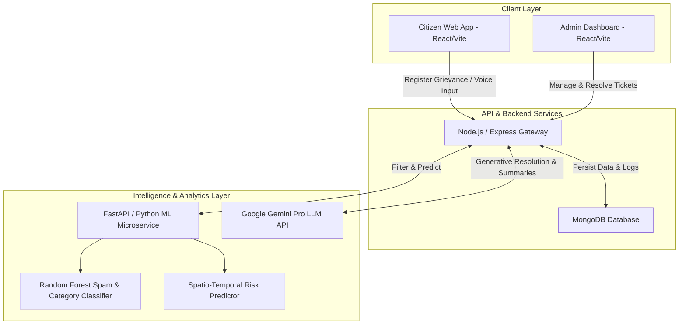

# 🏛️ NagrikConnect AI – Unified Grievance Intelligence & Resolution Platform

[](https://opensource.org/licenses/MIT)
[](https://nodejs.org/)
[](https://react.dev/)
[](https://www.python.org/)
[](https://fastapi.tiangolo.com/)
[](https://www.mongodb.com/)
[](https://deepmind.google/technologies/gemini/)

> **Next-Generation AI-Driven Public Governance Platform**  
> *Transforming citizen grievance management from reactive complaint processing to proactive, automated, and predictive civic resolution.*

---

## 📋 Table of Contents

- [Overview](#-overview)
- [Problem Statement & Solution](#-problem-statement--solution)
- [System Architecture](#-system-architecture)
- [Key Features](#-key-features)
  - [Citizen Experience](#-citizen-experience)
  - [Admin & Departmental Governance](#-admin--departmental-governance)
  - [AI & Predictive Intelligence](#-ai--predictive-intelligence)
- [Tech Stack](#-tech-stack)
- [Project Directory Structure](#-project-directory-structure)
- [Getting Started](#-getting-started)
  - [Prerequisites](#prerequisites)
  - [Automated Quick Start (Windows)](#automated-quick-start-windows)
  - [Manual Service Setup](#manual-service-setup)
- [API Reference](#-api-reference)
- [Machine Learning & AI Pipeline](#-machine-learning--ai-pipeline)
- [Contributing](#-contributing)
- [License](#-license)

---

## 🌐 Overview

**NagrikConnect AI** (Unified Grievance Intelligence & Resolution Platform) bridges the gap between citizens and municipal authorities. By integrating **Machine Learning, Natural Language Processing, and Generative AI**, NagrikConnect automatically filters spam, categorizes grievances, detects duplicate tickets, monitors social sentiment, escalates urgent issues based on SLAs, and predicts future civic bottlenecks before they escalate.

---

## 🧠 Problem Statement & Solution

### The Challenge
Legacy municipal grievance portals suffer from:
* ⌛ **Delayed Manual Triage**: High volumes of unstructured text cause processing backlogs.
* ⚠️ **Spam & Duplicates**: Multiple reports for the same issue clutter administrative bandwidth.
* 🔄 **Reactive Resolution**: Authorities respond only after widespread complaints occur.
* 🗣️ **Language & Literacy Barriers**: Complex form submission excludes non-English or low-literacy citizens.

### The NagrikConnect AI Solution
* 🤖 **Smart Automated Intake**: Multi-lingual voice-to-text intake in 10+ Indian languages paired with instant AI classification.
* 🛡️ **Intelligent Spam & Duplicate Filtering**: ML algorithms analyze text semantics to eliminate spam and merge duplicate claims automatically.
* 📈 **Predictive Risk Analytics**: Spatio-temporal machine learning models identify risk zones for proactive preventative maintenance.
* ⚡ **Automated SLA & Escalation**: Urgent civic emergencies bypass normal queues and auto-escalate directly to department heads.

---

## 🏗️ System Architecture



---

## ✨ Key Features

### 👤 Citizen Experience
- **🎙️ Voice-to-Text Intake**: Submit grievances naturally in spoken voice using browser Web Speech API.
- **🌍 Multi-Language Support**: Seamless translation support for 10+ regional Indian languages.
- **📍 Geo-Tagging & Media Upload**: Attach live geolocation data along with images/PDF proof.
- **🗺️ Interactive AI Tour**: Guided onboard walkthrough introducing all platform features.
- **📊 Real-time Ticket Tracking**: Live updates on grievance review, departmental assignment, and resolution status.

### 🛠️ Admin & Departmental Governance
- **📊 Centralized Command Dashboard**: Analytics over grievance density, SLA compliance, and department performance.
- **⚡ Emergency SLA Escalation**: Automated SLA countdown triggers department escalation for critical issues.
- **📄 Instant PDF Resolution Slips**: Generate formal resolution notices and closure reports automatically using PDFKit.
- **🐦 Social Media Listener**: Real-time monitoring of civic grievances posted across Twitter/X and social channels.

### 🤖 AI & Predictive Intelligence
- **🚫 ML Spam Detection**: Random Forest classification model filtering fraudulent or malicious filings.
- **👯 Duplicate Ticket Merging**: Cosine similarity & semantic text analysis preventing redundant ticket creation.
- **🔮 Spatio-Temporal Future Risk Forecasting**: ML models predicting complaint spikes by location and category (e.g. predicting water scarcity in specific municipal wards within 24-48 hours).
- **💡 Generative Resolution Suggestions**: Google Gemini Pro generates suggested action steps for administrative officers based on grievance context.

---

## 🧪 Tech Stack

| Layer | Technology | Purpose |
| :--- | :--- | :--- |
| **Frontend** | React 18, Vite, Tailwind CSS, Lucide Icons | Responsive Citizen & Admin User Interfaces |
| **Backend API** | Node.js, Express.js, Mongoose | Core REST API, Workflow Routing, File Uploads |
| **Database** | MongoDB | Document Storage for Grievance & User Data |
| **AI Server** | Python 3.10+, FastAPI, Uvicorn | Microservice host for ML inference APIs |
| **Machine Learning** | Scikit-Learn, Pandas, NumPy, Joblib | Classification, Spam Detection, Spatio-Temporal Prediction |
| **Generative AI** | Google Gemini Pro API | NLP Resolution Generation & Auto-Summarization |
| **Speech & Media** | Web Speech API, PDFKit | Voice Input Processing & Resolution PDF Export |

---

## 📂 Project Directory Structure

```
Unified-Grievance-Intelligence-Resolution-Platform/
├── 📁 admin/                 # Department Administrative Web Portal (React + Vite)
│   ├── 📁 src/               # Admin pages, components, & dashboard views
│   └── 📄 package.json       # Admin frontend dependencies
├── 📁 client/                # Citizen Web Application (React + Vite)
│   ├── 📁 src/               # Citizen forms, voice input, AI tour & tracking UI
│   └── 📄 package.json       # Citizen frontend dependencies
├── 📁 backend/               # Node.js API Service
│   ├── 📁 routers/           # API routes (grievance, user, duplicate, escalation, social)
│   ├── 📁 models/            # Mongoose Database Schemas
│   ├── 📁 services/          # External API integrations & logic
│   └── 📄 server.js          # Main Express server entry point
├── 📁 scripts/               # Python AI/ML Microservice & Datasets
│   ├── 📄 api.py             # FastAPI prediction endpoints
│   ├── 📄 predictor.py       # Spatio-temporal forecasting logic
│   ├── 📄 complaint_classifier.py # ML Classification pipeline
│   └── 📄 *.pkl              # Pre-trained ML models & vectorizers
├── 📁 mongodb/               # Database initialization & local assets
├── 📄 SETUP.bat              # Automated installation script
├── 📄 start-all.bat          # Multi-service launcher script
├── 📄 stop-all.bat           # Graceful service shutdown script
└── 📄 README.md              # Project documentation
```

---

## ⚙️ Getting Started

### Prerequisites
Ensure the following runtime environments are installed on your machine:
- **Node.js** (v18.0 or higher) & `npm`
- **Python** (v3.10 or higher) & `pip`
- **MongoDB** (v6.0 or higher running locally on default port `27017` or via MongoDB Atlas connection string)

---

### Automated Quick Start (Windows)

The repository provides automated batch files for setup and execution:

1. **Install All Dependencies**:
   Double-click `SETUP.bat` or run:
   ```cmd
   SETUP.bat
   ```
   *Select Option `1` for First-Time Environment Setup.*

2. **Launch All Services**:
   Run:
   ```cmd
   start-all.bat
   ```
   *This starts Backend (`:5000`), Citizen Portal (`:5173`), Admin Portal (`:5174`), and Python AI Server (`:8000`).*

3. **Stop All Services**:
   Run:
   ```cmd
   stop-all.bat
   ```

---

### Manual Service Setup

If you prefer starting services individually in separate terminals:

```bash
# 1. Backend Server (Node.js)
cd backend
npm install
npm run dev

# 2. Citizen Frontend (React + Vite)
cd ../client
npm install
npm run dev

# 3. Admin Dashboard (React + Vite)
cd ../admin
npm install
npm run dev

# 4. Python ML Server (FastAPI)
cd ../scripts
pip install -r requirements.txt
python -m uvicorn api:app --host 127.0.0.1 --port 8000 --reload
```

---

## 🔌 API Reference

### Grievance Operations (`/api/grievance`)

#### `POST /grievance` – Submit a New Grievance
Submits a citizen grievance, triggers ML spam check, duplicate analysis, and auto-classification.

**Request Body (`multipart/form-data`):**
```json
{
  "title": "Water Pipeline Leakage",
  "description": "Clean water leaking continuously near Ward 4 market area for 2 days.",
  "category": "Water Supply",
  "location": "Ward 4, Thane",
  "coordinates": { "lat": 19.2183, "lng": 72.9781 }
}
```

#### `GET /grievance/user/:userId` – Get User Complaints
Fetches all complaints logged by a specific citizen.

---

### AI & Prediction Endpoints (`/api/ai`)

#### `POST /predict-spam` – Check Spam Status
Evaluates complaint description against trained Random Forest model.

#### `GET /predict-future` – Forecast Spatio-Temporal Risk
Returns high-risk complaint forecasts for proactive municipal action.

**Response:**
```json
[
  {
    "area": "Ward 4 - Thane",
    "category": "Water Supply",
    "risk_level": "High",
    "confidence_score": 0.86,
    "predicted_timeframe": "Next 24 Hours",
    "recommended_action": "Inspect main water supply valves and dispatch maintenance team."
  }
]
```

---

## 🔬 Machine Learning & AI Pipeline

```
Raw Text Input
      │
      ▼
Text Preprocessing (TF-IDF Vectorization & Stopword Removal)
      │
      ▼
Random Forest Classifier (Spam vs Genuine)
      │
      ├────► [Spam Detected] ──► Flag & Reject Ticket
      │
      └────► [Genuine] ──► Cosine Similarity (Duplicate Detection)
                                 │
                                 ▼
                     Category Classification & Gemini Pro Summary
                                 │
                                 ▼
                     Spatio-Temporal Risk Model Update
```

---

## 🤝 Contributing

Contributions are welcome! To contribute:
1. Fork the repository.
2. Create your feature branch (`git checkout -b feature/AmazingFeature`).
3. Commit your changes (`git commit -m 'Add some AmazingFeature'`).
4. Push to the branch (`git push origin feature/AmazingFeature`).
5. Open a Pull Request.

---

## 📜 License

Distributed under the **MIT License**. See `LICENSE` for more details.

---

<p align="center">
  Developed with ❤️ for Smart Governance & Intelligent Citizen Resolution.
</p>
